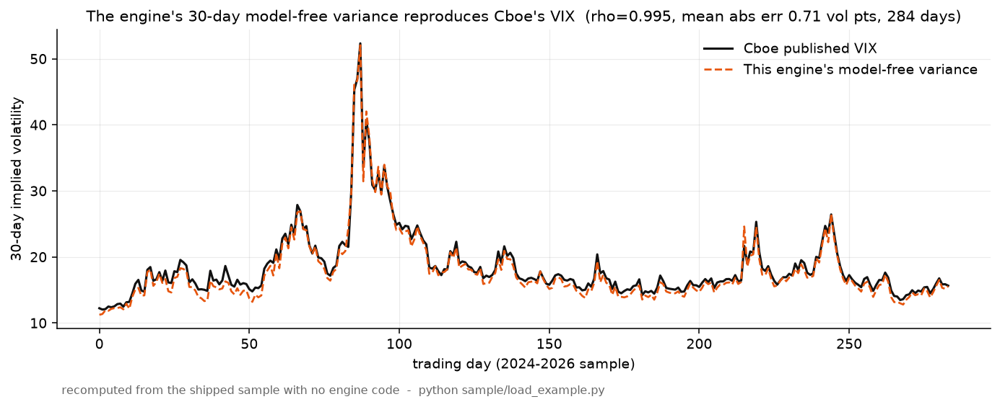
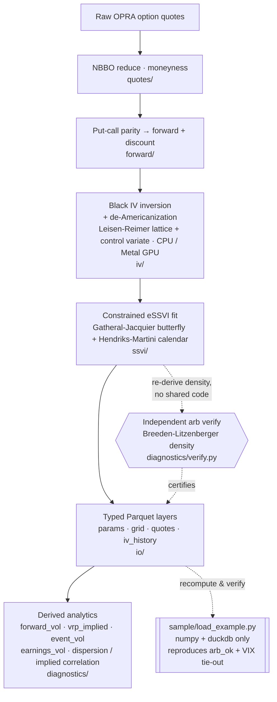
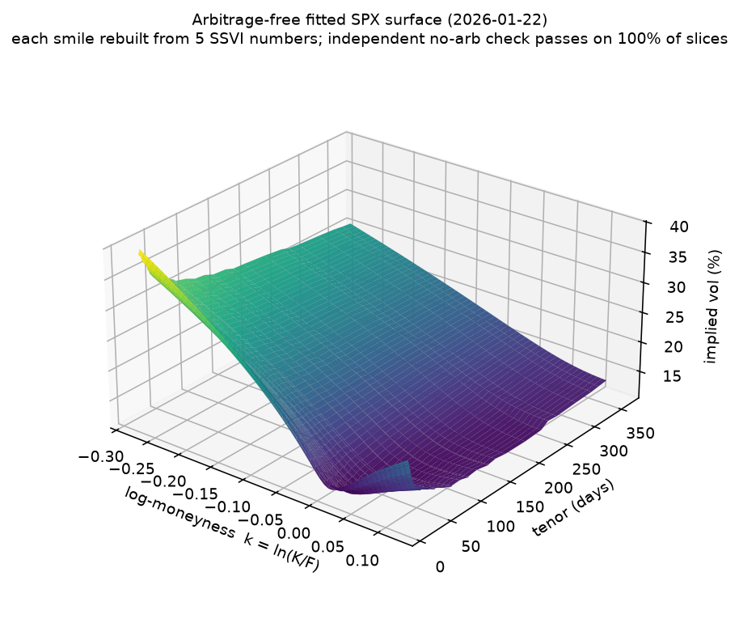

# essvi

`essvi` fits arbitrage-free implied-volatility surfaces to US-equity and index options, straight from raw OPRA quotes, using the extended-SSVI (eSSVI) parameterization. Unlike most vol-surface code, every fitted surface is re-checked for arbitrage by a separate verifier that shares no code with the fit, and the engine's own 30-day model-free variance reproduces Cboe's published VIX at 0.995 correlation over 284 days. A small bundled sample lets you reproduce both yourself with nothing but numpy and duckdb.


*The engine's 30-day model-free variance, computed only from its own fitted surfaces, against Cboe's published VIX: 0.995 correlation and 0.71 vol-pt mean absolute error over 284 trading days in the bundled sample. Reproduce it with `python sample/load_example.py`.*

---

## Architecture



The verifier sits on the output side of the pipeline. It re-derives the risk-neutral density from a finished surface and certifies it, separately from the fit that produced it, which is what lets "arbitrage-free" be a property you can test rather than one you assert.

### Directory map

```
src/essvi/
  quotes/         NBBO reduction, moneyness
  forward/        parity-implied forward/discount, forward-vol term structure
  iv/             Black inversion + de-Americanization (black.py, deam.py, deam_gpu.py, Metal)
  ssvi/           eSSVI fitting: model, objective, analytic constraints (GJ butterfly + HM calendar)
  pipeline/       snapshot ETL, fit orchestration, deterministic rounding
  diagnostics/    independent Breeden-Litzenberger arb gate (verify.py), reprice RMSE, derived analytics
  io/             typed-Parquet writers, rate curves
  repro/          engine-free reference implementation used by the verifier
sample/           runnable extract: one SPX day (all layers), 284-day VIX series, Cboe CSV, load_example.py
tests/            unit + engine-free reference tests
derived/          cross-name analytics: dispersion / implied correlation + index weights (tested)
```

The engine writes typed Parquet in layers: `vol_surface_params` (the fitted surface, about five numbers per expiry), `vol_surface_grid` (dense IV grid), `option_quotes`, `iv_history`, plus derived `forward_vol`, `vrp_implied`, `event_vol`, `earnings_vol`, and cross-name dispersion / implied correlation.

## The problem

A vol surface that isn't fit under the right no-arbitrage constraints can quietly imply negative probabilities: a butterfly you could print money on, or a calendar spread with a free lunch in it. None of that is visible by eye. Most vol-surface code asserts the no-arbitrage property inside the same routine that does the fitting, so you end up taking it on trust.

This engine keeps the two apart. It fits eSSVI surfaces to raw OPRA option quotes under Gatheral-Jacquier butterfly and Hendriks-Martini calendar constraints. A separate verifier that shares no code with the fit then re-derives the Breeden-Litzenberger implied density on a dense grid and checks that it stays non-negative. On the bundled sample the check passes on all 27,275 fitted slices (`fit_status=ok` slices with `arb_ok=true`).

It also ties out to a public number. The 30-day model-free variance computed from these surfaces tracks Cboe's published VIX at 0.995 correlation over 284 days, which you can reproduce against Cboe's free CSV with numpy and duckdb.

## What it does

- **Arbitrage-free, and independently checked.** Surfaces are fit under Gatheral-Jacquier butterfly and Hendriks-Martini calendar constraints, then re-checked on a dense grid by a Breeden-Litzenberger density test written separately from the fit. On the bundled sample, all 27,275 of 27,275 fitted slices pass.
- **Reproduces the VIX.** The 30-day model-free variance, taken from the fitted surfaces with no VIX inputs, tracks Cboe's published VIX at 0.995 correlation and 0.71 vol-pt mean absolute error across 284 trading days in the sample. On the full internal history, which isn't included here, the correlation is about 0.997 and VXN about 0.988; those two figures aren't reproducible from this repo.
- **De-Americanization to about 1 bp.** Single-name American options are stripped of their early-exercise premium with a Leisen-Reimer binomial lattice and a control variate, giving European-equivalent Black IVs that are comparable across names, at roughly 1 bp of IV error against a QuantLib reference. A Metal-GPU path runs about 4x the 28-core CPU, or about 120x a single thread.
- **Deterministic.** Fits are byte-identical across re-runs, from pinned BLAS threads and deterministic pre-write rounding, over the full 284-day history.
- **Tested and typed.** 118 unit tests, green on a fresh clone under Python 3.11 or 3.12. Output is written as plain typed Parquet.

## The fitted surface


*A fitted eSSVI surface for SPX: implied vol across strike (log-moneyness) and expiry, reconstructed from about five eSSVI numbers per expiry, with every slice passing the butterfly and calendar checks.*

Each surface is an eSSVI parameterization: per expiry, roughly five numbers (`theta, rho, phi`, plus the parity-implied `forward` and `discount`) that reconstruct total variance `w(k)`, and therefore implied vol at any strike, via the published SSVI formula. Because it's that compact, the surface is auditable by hand, and the density test that certifies it runs directly on the closed-form derivatives.

## Quickstart

```bash
python3.12 -m venv .venv && ./.venv/bin/pip install -e .   # needs Python 3.11 or 3.12
python sample/load_example.py                              # numpy + duckdb only
```

`sample/` is a small extract: one SPX trading day with all output layers, a 284-day model-free-variance series, and Cboe's VIX CSV. It's enough to reconstruct any strike's IV from the fitted parameters, run the arbitrage verifier, and reproduce the VIX tie-out over a real history rather than a single day. Point the engine at your own OPRA quotes to fit a full history; only this sample is bundled.

## Verify it yourself

`sample/load_example.py` recomputes three things from the bundled Parquet with no engine code in the loop, using only numpy and duckdb:

1. **Reconstruct a surface.** Rebuild `σ(K,T)` for an SPX expiry from the five stored numbers via the published SSVI total-variance formula.
2. **Re-run the no-arbitrage check.** Recompute the Breeden-Litzenberger implied density `g(k)` on a dense grid and confirm it stays non-negative, reproducing the recorded `arb_ok` flag.
3. **Reproduce the benchmark.** Recompute 30-day model-free variance and correlate it against Cboe's public VIX CSV: the 0.995 / 0.71-vol-pt tie-out over 284 matched days.

Each headline claim is meant to be checkable by someone who has never seen the code:

| Claim | How to check it | What you should see |
|---|---|---|
| Surfaces are arbitrage-free | Rebuild σ(K,T) from the SSVI params, run the density test on a dense grid | `min density g(k) ≥ 0` matches the recorded `arb_ok`; 27,275 / 27,275 slices pass |
| It reproduces the VIX | Correlate the 30-day model-free variance against Cboe's public VIX CSV | 0.995 correlation, 0.71 vol-pt mean \|error\|, 284 days |
| The check is independent | Read `diagnostics/verify.py` against `ssvi/` | The verifier re-derives density numerically and never calls the fitter |

## Built end-to-end

Every stage is mine: raw-quote ETL, forward/discount inversion via put-call parity, de-Americanization, the constrained eSSVI fit, the independent verifier, and the derived analytics. They all have to line up for the VIX tie-out at the top to hold, and getting the market-data plumbing to agree with the numerical fitting to agree with the verifier is most of the work.

## References

- **Gatheral & Jacquier**: arbitrage-free SVI parameterizations (the butterfly constraints, SSVI).
- **Hendriks & Martini**: eSSVI and the calendar-arbitrage conditions.
- **Breeden & Litzenberger**: option prices to implied risk-neutral density (the independent arb check).
- **Carr & Madan / Martin**: model-free implied variance and the log contract (the VIX-style computation).
- **Dubinsky & Johannes**: event / earnings-volatility decomposition.
- **Leisen & Reimer**: binomial lattice with fast convergence (de-Americanization).

## Status and limitations

Research / portfolio codebase, v0.4.0. It fits the SPX/NDX index complex, de-Americanizes single-name options to European-equivalent IVs, and computes a stack of derived analytics layers on top.

- **In the repo:** a runnable SPX sample (all layers), the arbitrage verifier, and the 284-day VIX-reproduction check: enough to confirm the headline claims.
- **Bring your own data:** point the engine at OPRA quotes and it fits a full history; only the small `sample/` extract is bundled, with a `load_example.py` that needs nothing but the sample.
- **Which figures are reproducible here:** the 0.995 VIX correlation, the 0.71 vol-pt MAE, and the 27,275 / 27,275 arb-pass all come from the bundled sample. The ~0.997 VIX and ~0.988 VXN correlations are on the full internal history and are not reproducible from this repo.
- **Underlier of record:** this is an OPRA-options-only archive with no traded underlier, so the de-Americanization parity-implied spot is the underlier of record throughout.
- **Tests:** 118, green on a fresh clone, Python 3.11 / 3.12.
